# IMKAN WorkDrive — Database V2 ER Diagram

Mermaid ER diagram of the full schema (Prisma/MySQL, 24 application tables).

```mermaid
erDiagram
    ORGANIZATION ||--o{ USER : "has members"
    ORGANIZATION ||--o{ TEAM_FOLDER : "owns"
    ORGANIZATION ||--o{ FOLDER : "owns"
    ORGANIZATION ||--o{ FILE : "owns"
    ORGANIZATION ||--o{ FILE_VERSION : "owns"
    ORGANIZATION ||--o{ STORAGE_OBJECT : "owns"
    ORGANIZATION ||--o{ TAG : "owns"
    ORGANIZATION ||--o{ TRASH_ENTRY : "scopes"
    ORGANIZATION ||--o{ FILE_ACTIVITY : "scopes"
    ORGANIZATION ||--o{ FILE_SHARE : "scopes"
    ORGANIZATION ||--o| STORAGE_QUOTA : "has one"
    ORGANIZATION ||--o{ AUDIT_LOG : "records"
    ORGANIZATION ||--o{ ACCESS_EVENT : "records"
    ORGANIZATION ||--o{ NOTIFICATION : "scopes"
    ORGANIZATION ||--o{ COMMENT : "scopes"
    ORGANIZATION ||--o{ FAVORITE : "scopes"
    ORGANIZATION ||--o{ ORGANIZATION_INVITATION : "issues"

    USER ||--o{ SESSION : "authenticates via"
    USER ||--o{ PASSWORD_RESET_TOKEN : "requests"
    USER ||--o{ TEAM_FOLDER_MEMBER : "joins"
    USER ||--o{ FOLDER : "owns (FolderOwner)"
    USER ||--o{ FILE : "owns (FileOwner)"
    USER ||--o{ FILE_VERSION : "uploads (VersionUploader)"
    USER ||--o{ FILE_SHARE : "creates (FileShareCreator)"
    USER ||--o{ FILE_SHARE_RECIPIENT : "receives"
    USER ||--o{ TRASH_ENTRY : "deleted by (TrashEntryDeletedBy)"
    USER |o--o{ TRASH_ENTRY : "restored by (TrashEntryRestoredBy)"
    USER ||--o{ COMMENT : "authors"
    USER ||--o{ NOTIFICATION : "receives"
    USER ||--o{ FAVORITE : "stars"
    USER ||--o{ ACCESS_EVENT : "performs"
    USER |o--o{ AUDIT_LOG : "acts in (nullable = system)"
    USER |o--o{ FILE_ACTIVITY : "triggers (nullable)"
    USER ||--o{ ORGANIZATION_INVITATION : "sends (InvitationSender)"

    TEAM_FOLDER ||--o{ TEAM_FOLDER_MEMBER : "has member rows"
    TEAM_FOLDER |o--o{ FOLDER : "roots"

    FOLDER |o--o{ FOLDER : "parent-child (FolderTree)"
    FOLDER ||--o{ FILE : "contains"
    FOLDER |o--o{ TRASH_ENTRY : "folder deletions"

    FILE ||--o{ FILE_VERSION : "versioned by"
    FILE ||--o| FILE_METADATA : "described by (1:1 unique file_id)"
    FILE ||--o{ COMMENT : "discussed in"
    FILE ||--o{ FILE_TAG : "tagged via"
    FILE ||--o{ FILE_SHARE : "shared as"
    FILE ||--o{ FILE_ACTIVITY : "activity timeline"
    FILE ||--o{ TRASH_ENTRY : "trash ledger"
    FILE |o--o{ STORAGE_OBJECT : "soft owner (SET NULL)"

    FILE_VERSION }o--|| STORAGE_OBJECT : "points at physical object"

    TAG ||--o{ FILE_TAG : "attached via"

    FILE_SHARE ||--o{ FILE_SHARE_RECIPIENT : "direct recipients"

    COMMENT |o--o{ COMMENT : "threaded replies (CommentThread)"

    TEAM_FOLDER_MEMBER }o--|| USER : "member"

    FILE_TAG }o--|| FILE : "file"
    FILE_TAG }o--|| TAG : "tag"

    FILE_SHARE_RECIPIENT }o--|| FILE_SHARE : "share"

    FILE_METADATA ||--|| FILE : "one-to-one"
```

## Relationship notes

* `FILE → STORAGE_OBJECT` is **many-to-one per version**: several versions
  (and files, after copy/restore) can reference the same physical object. The
  `storage_objects.file_id` column is a soft owner link (`ON DELETE SET NULL`).
* `FILE ↔ FILE_METADATA` is a strict one-to-one enforced by a unique `file_id`.
* `COMMENT` self-relation implements threaded replies; deletion is soft
  (`deleted_at`) so threads keep their shape.
* `FAVORITE` and `ACCESS_EVENT` remain polymorphic (`resource_type`,
  `resource_id`) for cross-resource reuse.
* All org-scoped relations are `ON DELETE RESTRICT` against `organizations`
  to protect tenant integrity; child tables cascade from their owning entity
  where noted in DATABASE-V2.md §7.

## Enum columns

`files.status / file_type / visibility`, `file_versions.status`,
`storage_objects.status`, `trash_entries.reason`, `file_shares.permission /
status`, `access_events.action / resource_type`, `notifications.type /
priority / resource_type`, `organization_invitations.status / role`,
`users.role`, `team_folder_members.role`, `favorites.resource_type`,
`file_activities.action`. See DATABASE-V2.md §6 for values.
